```mermaid
graph TB
    %% ===========================================
    %% ARCHITECTURE GLOBALE DU ROBOT AUTONOME
    %% ===========================================
    
    subgraph "🖥️ RASPBERRY PI (Contrôleur Principal)"
        RPI[Raspberry Pi<br/>Python 3]
        CONFIG[config.json<br/>Configuration]
        LOADER[loader.py<br/>Module Loader]
        
        subgraph "📁 Scripts Python"
            TEST_COM[test_communication.py]
            TEST_USB[test_usb_detection.py]
            TEST_PROG[test_program.py]
            TEST_TRAJ[test_simple_traj.py]
        end
        
        RPI --> CONFIG
        RPI --> LOADER
        LOADER --> TEST_COM
        LOADER --> TEST_USB
    end
    
    subgraph "🔌 COMMUNICATION USB"
        USB_PYTHON[Python USB Com<br/>• messages.py<br/>• com.py<br/>• dummy.py]
        USB_CPP[C++ USB Com<br/>• messages.h<br/>• com.h<br/>• crc.h]
        
        USB_PYTHON <--> USB_CPP
    end
    
    subgraph "🤖 TEENSY 4.1 - MOTEUR"
        TEENSY_M[Teensy 4.1<br/>Base Motrice]
        MAIN_M[main.cpp<br/>Contrôleur Principal]
        
        subgraph "📚 Bibliothèques Moteur"
            HOLO[holonomic_basis<br/>• holonomic_basis.h<br/>• structures.h]
            MOTOR_DRV[motors_driver<br/>• motors_driver.h]
            PID_LIB[pid<br/>• pid.h]
            TEENSY_STEP[TeensyStep4<br/>Contrôle Moteurs]
            ENCODER[Encoder<br/>Capteurs Position]
        end
        
        TEENSY_M --> MAIN_M
        MAIN_M --> HOLO
        MAIN_M --> MOTOR_DRV
        MAIN_M --> PID_LIB
        MAIN_M --> TEENSY_STEP
        MAIN_M --> ENCODER
    end
    
    subgraph "🤖 TEENSY 4.1 - ACTUATEUR"
        TEENSY_A[Teensy 4.1<br/>Actuateurs]
        MAIN_A[main.cpp<br/>Contrôleur Actuateurs]
        
        subgraph "📚 Bibliothèques Actuateur"
            SERVO_LIB[Adafruit PWM Servo<br/>Servomoteurs]
            STEPPER_LIB[Bonezegei_A4988<br/>Moteurs Pas-à-Pas]
            LCD_LIB[LiquidCrystal_I2C<br/>Écran LCD]
        end
        
        TEENSY_A --> MAIN_A
        MAIN_A --> SERVO_LIB
        MAIN_A --> STEPPER_LIB
        MAIN_A --> LCD_LIB
    end
    
    subgraph "⚙️ HARDWARE ROBOT"
        subgraph "🚗 Base Mobile (Teensy Moteur)"
            MOTOR1[Moteur 1<br/>Avant]
            MOTOR2[Moteur 2<br/>Arrière Gauche]
            MOTOR3[Moteur 3<br/>Arrière Droite]
            ENC1[Encodeur 1]
            ENC2[Encodeur 2]
            ENC3[Encodeur 3]
        end
        
        subgraph "🦾 Actuateurs (Teensy Actuateur)"
            SERVOS[Servomoteurs<br/>PCA9685]
            STEPPERS[Moteurs Pas-à-Pas<br/>A4988]
            SWITCHES[Capteurs Switch]
            LCD[Écran LCD I2C]
        end
    end
    
    %% ===========================================
    %% CONNEXIONS PRINCIPALES
    %% ===========================================
    
    %% Communication USB
    RPI <--> |USB Serial<br/>115200 baud<br/>CRC8| USB_PYTHON
    USB_PYTHON <--> |Messages<br/>Structures| TEENSY_M
    USB_PYTHON <--> |Messages<br/>Structures| TEENSY_A
    
    %% Hardware Connections - Moteurs
    TEENSY_M --> MOTOR1
    TEENSY_M --> MOTOR2
    TEENSY_M --> MOTOR3
    ENC1 --> TEENSY_M
    ENC2 --> TEENSY_M
    ENC3 --> TEENSY_M
    
    %% Hardware Connections - Actuateurs
    TEENSY_A --> SERVOS
    TEENSY_A --> STEPPERS
    SWITCHES --> TEENSY_A
    TEENSY_A --> LCD
    
    %% ===========================================
    %% STYLES
    %% ===========================================
    
    classDef raspberry fill:#d4edda,stroke:#155724,color:#000
    classDef teensy fill:#fff3cd,stroke:#856404,color:#000
    classDef hardware fill:#f8d7da,stroke:#721c24,color:#000
    classDef communication fill:#cce5ff,stroke:#004085,color:#000
    classDef library fill:#e2e3e5,stroke:#383d41,color:#000
    
    class RPI,CONFIG,LOADER,TEST_COM,TEST_USB,TEST_PROG,TEST_TRAJ raspberry
    class TEENSY_M,MAIN_M,TEENSY_A,MAIN_A teensy
    class MOTOR1,MOTOR2,MOTOR3,ENC1,ENC2,ENC3,SERVOS,STEPPERS,SWITCHES,LCD hardware
    class USB_PYTHON,USB_CPP communication
    class HOLO,MOTOR_DRV,PID_LIB,TEENSY_STEP,ENCODER,SERVO_LIB,STEPPER_LIB,LCD_LIB library
```

## 📊 ARCHITECTURE DU SYSTÈME

### 🎯 **Vue d'ensemble**
- **Raspberry Pi** : Cerveau principal (Python)
- **2 x Teensy 4.1** : Contrôleurs temps réel (C++)
- **Communication** : USB série avec CRC8

### 🔄 **Flux de données**

1. **Raspberry Pi** → **Teensy Moteur** : Consignes de position
2. **Teensy Moteur** → **Raspberry Pi** : Position actuelle, odométrie
3. **Raspberry Pi** → **Teensy Actuateur** : Commandes actuateurs
4. **Teensy Actuateur** → **Raspberry Pi** : États capteurs

### 📡 **Messages principaux**
- `SET_TARGET_POSITION` : Définir position cible
- `UPDATE_ROLLING_BASIS` : Retour position actuelle
- `SET_SERVO_ANGLE` : Contrôle servomoteurs
- `STEPPER_STEP` : Contrôle moteurs pas-à-pas

### 🔧 **Configuration**
- **Baudrate** : 115200
- **Serial Number** : 18421350
- **VID/PID** : 5824/1155
- **CRC** : Activé pour fiabilité