```mermaid
graph TD
    %% ===========================================
    %% ORGANISATION DU PROJET
    %% ===========================================
    
    ROOT[📁 CDR-Nantes<br/>Racine du projet]
    
    subgraph "📁 common/ (Bibliothèques partagées)"
        COMMON[common/]
        
        subgraph "🐍 Python Modules"
            TEENSY_PY[teensy/<br/>• base_teensy.py<br/>• gpio_teensy.py]
            USB_PY[usb_com/python/<br/>• messages.py<br/>• com.py<br/>• dummy.py]
        end
        
        subgraph "⚡ C++ Libraries"
            USB_CPP[usb_com/cpp/<br/>• com.h/cpp<br/>• messages.h<br/>• crc.h/cpp]
        end
        
        COMMON --> TEENSY_PY
        COMMON --> USB_PY
        COMMON --> USB_CPP
    end
    
    subgraph "🤖 robot1/ (Instance Robot)"
        ROBOT1[robot1/]
        
        subgraph "🖥️ Raspberry Pi Code"
            RASP[rasp/<br/>• config.json<br/>• loader.py<br/>• test_*.py]
        end
        
        subgraph "🔧 Teensy Moteur"
            TM_FOLDER[teensy_moteur/]
            TM_CONF[platformio.ini]
            TM_MAIN[src/main.cpp]
            TM_CONFIG[include/config.h]
            
            subgraph "📚 Local Libraries"
                HOLO_LIB[lib/holonomic_basis/<br/>• holonomic_basis.h/cpp<br/>• structures.h]
                MOTOR_LIB[lib/motors_driver/<br/>• motors_driver.h/cpp]
                PID_LIB[lib/pid/<br/>• pid.h/cpp]
            end
            
            TM_FOLDER --> TM_CONF
            TM_FOLDER --> TM_MAIN
            TM_FOLDER --> TM_CONFIG
            TM_FOLDER --> HOLO_LIB
            TM_FOLDER --> MOTOR_LIB
            TM_FOLDER --> PID_LIB
        end
        
        subgraph "🦾 Teensy Actuateur"
            TA_FOLDER[teensy_actuator/]
            TA_CONF[platformio.ini]
            TA_MAIN[src/main.cpp]
            TA_CONFIG[include/config.h]
            
            TA_FOLDER --> TA_CONF
            TA_FOLDER --> TA_MAIN
            TA_FOLDER --> TA_CONFIG
        end
        
        ROBOT1 --> RASP
        ROBOT1 --> TM_FOLDER
        ROBOT1 --> TA_FOLDER
    end
    
    ROOT --> COMMON
    ROOT --> ROBOT1
    
    %% ===========================================
    %% DÉPENDANCES EXTERNES
    %% ===========================================
    
    subgraph "🌐 Dépendances Externes"
        EXT[External Dependencies]
        
        subgraph "🐍 Python Packages"
            PYSERIAL[pyserial<br/>Communication série]
            CRC8[crc8<br/>Vérification intégrité]
            STRUCT[struct<br/>Sérialisation binaire]
        end
        
        subgraph "⚡ PlatformIO Libraries"
            TEENSY_STEP[TeensyStep4<br/>Contrôle moteurs]
            SERVO_DRV[Adafruit PWM Servo<br/>PCA9685]
            STEPPER_DRV[Bonezegei_A4988<br/>Drivers steppers]
            ENCODER_LIB[Encoder<br/>Lecture encodeurs]
            LCD_I2C[LiquidCrystal_I2C<br/>Affichage LCD]
        end
        
        EXT --> PYSERIAL
        EXT --> CRC8
        EXT --> STRUCT
        EXT --> TEENSY_STEP
        EXT --> SERVO_DRV
        EXT --> STEPPER_DRV
        EXT --> ENCODER_LIB
        EXT --> LCD_I2C
    end
    
    %% ===========================================
    %% CONNEXIONS LOGIQUES
    %% ===========================================
    
    %% Python utilise les modules common
    RASP -.->|import| USB_PY
    RASP -.->|import| TEENSY_PY
    
    %% Teensy moteur utilise les libs
    TM_MAIN -.->|#include| USB_CPP
    TM_MAIN -.->|#include| HOLO_LIB
    TM_MAIN -.->|#include| MOTOR_LIB
    TM_MAIN -.->|#include| PID_LIB
    
    %% Teensy actuateur utilise les libs
    TA_MAIN -.->|#include| USB_CPP
    
    %% Liens vers dépendances externes
    USB_PY -.->|uses| PYSERIAL
    USB_PY -.->|uses| CRC8
    TM_MAIN -.->|uses| TEENSY_STEP
    TM_MAIN -.->|uses| ENCODER_LIB
    TA_MAIN -.->|uses| SERVO_DRV
    TA_MAIN -.->|uses| STEPPER_DRV
    TA_MAIN -.->|uses| LCD_I2C
    
    %% ===========================================
    %% STYLES
    %% ===========================================
    
    classDef folder fill:#e3f2fd,stroke:#1976d2,color:#000
    classDef python fill:#c8e6c9,stroke:#388e3c,color:#000
    classDef cpp fill:#ffecb3,stroke:#f57f17,color:#000
    classDef external fill:#fce4ec,stroke:#c2185b,color:#000
    classDef config fill:#f3e5f5,stroke:#7b1fa2,color:#000
    
    class ROOT,ROBOT1,COMMON,TM_FOLDER,TA_FOLDER,RASP folder
    class TEENSY_PY,USB_PY,RASP python
    class USB_CPP,TM_MAIN,TA_MAIN,HOLO_LIB,MOTOR_LIB,PID_LIB cpp
    class EXT,PYSERIAL,CRC8,STRUCT,TEENSY_STEP,SERVO_DRV,STEPPER_DRV,ENCODER_LIB,LCD_I2C external
    class TM_CONF,TA_CONF,TM_CONFIG,TA_CONFIG config
```

## 📁 STRUCTURE DÉTAILLÉE

### 🎯 **Organisation Hiérarchique**

```
CDR-Nantes/
├── 📄 CODING_RULES                    # Règles de codage
├── 📄 LICENSE                         # Licence du projet
├── 📄 README.md                       # Documentation principale
├── 📁 common/                         # 🔗 Bibliothèques partagées
│   ├── 📁 teensy/                     # Classes Python Teensy
│   │   ├── base_teensy.py            # Classe de base
│   │   ├── gpio_teensy.py            # Gestion GPIO
│   │   └── tools/gpio_manager/       # Gestionnaire GPIO
│   └── 📁 usb_com/                    # Communication USB
│       ├── 📁 cpp/                    # Implémentation C++
│       │   ├── include/              # Headers (.h)
│       │   └── src/                  # Sources (.cpp)
│       └── 📁 python/                 # Implémentation Python
│           ├── messages.py           # Définitions messages
│           ├── com/                  # Module communication
│           └── tools/                # Outils utilitaires
└── 📁 robot1/                        # 🤖 Instance de robot
    ├── 📁 rasp/                       # Code Raspberry Pi
    │   ├── config.json               # Configuration globale
    │   ├── loader.py                 # Chargeur de modules
    │   └── test_*.py                 # Scripts de test
    ├── 📁 teensy_moteur/              # Contrôleur moteurs
    │   ├── platformio.ini            # Config PlatformIO
    │   ├── src/main.cpp              # Code principal
    │   ├── include/config.h          # Configuration hardware
    │   └── lib/                      # Bibliothèques locales
    │       ├── holonomic_basis/      # Base holonomique
    │       ├── motors_driver/        # Pilote moteurs
    │       └── pid/                  # Contrôleur PID
    └── 📁 teensy_actuator/            # Contrôleur actuateurs
        ├── platformio.ini            # Config PlatformIO
        ├── src/main.cpp              # Code principal
        └── include/config.h          # Configuration hardware
```

### 🔄 **Flux de Compilation**

1. **Raspberry Pi** : Python → Interpréteur direct
2. **Teensy Moteur** : C++ → PlatformIO → Firmware .hex
3. **Teensy Actuateur** : C++ → PlatformIO → Firmware .hex