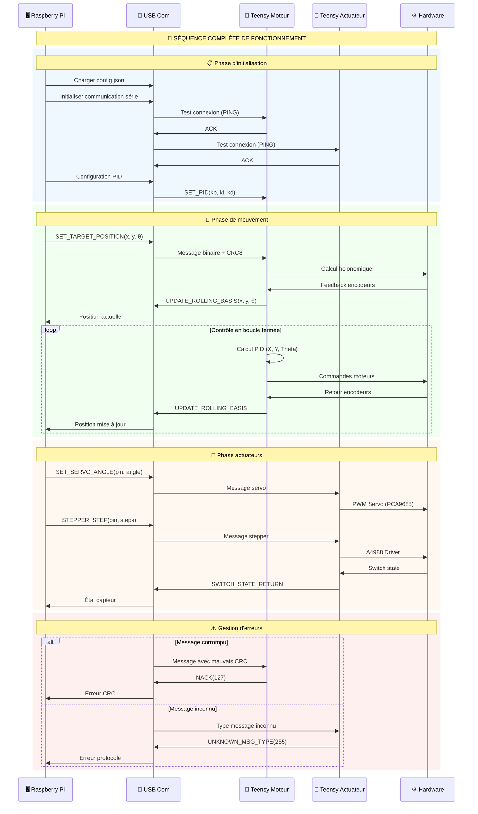

## 📨 PROTOCOLE DE COMMUNICATION

### 🔢 **IDs des Messages**

| Direction | Plage | Description | Exemples |
|-----------|-------|-------------|----------|
| RPI → Teensy | 0-126 | Commandes | `SET_TARGET_POSITION(0)` |
| Bidirectionnel | 127 | Erreur | `NACK(127)` |
| Teensy → RPI | 128-255 | Retours | `UPDATE_ROLLING_BASIS(128)` |

### 🔐 **Format des Messages**

```
[HEADER][DATA][CRC8][END_SIGNATURE]
│       │     │     └─ 0xBA,0xDD,0x1C,0xC5
│       │     └─ Vérification intégrité
│       └─ Données binaires
└─ Type de message (byte)
```

### ⚙️ **Messages Principaux**

#### 🚗 **Base Mobile (Teensy Moteur)**
- **SET_TARGET_POSITION(0)** : `{double x, double y, double theta}`
- **SET_PID(1)** : `{float kp, float ki, float kd, byte axis}`
- **UPDATE_ROLLING_BASIS(128)** : `{double x, double y, double theta}`

#### 🦾 **Actuateurs (Teensy Actuateur)**
- **SET_SERVO_ANGLE(7)** : `{byte pin, int angle}`
- **STEPPER_STEP(4)** : `{byte pin, int steps, int speed}`
- **SWITCH_STATE_RETURN(129)** : `{byte pin, bool state}`

### 🔧 **Configuration Communication**
- **Baudrate** : 115200 bps
- **Timeout** : 1000ms
- **CRC** : CRC8 polynomial
- **Buffer** : 256 bytes